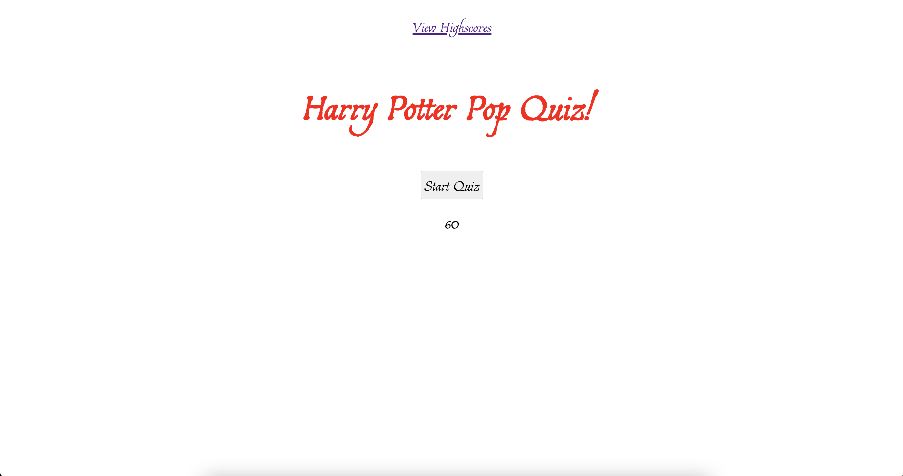
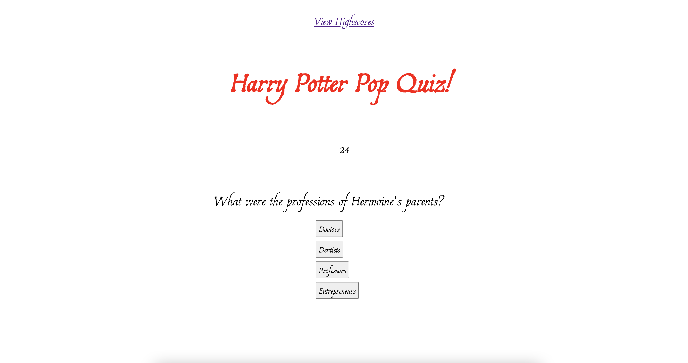
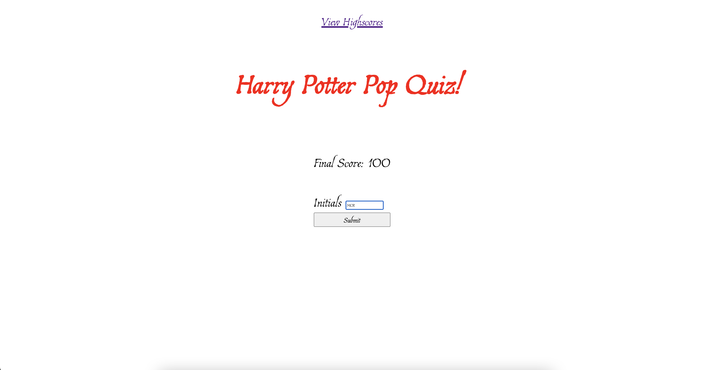
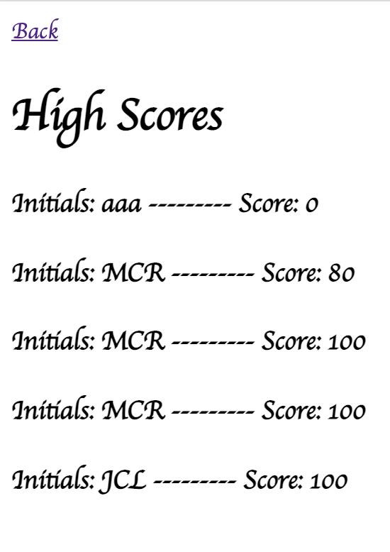

# Harry Potter Quiz

## Table of Contents
<a href="#description">Description</a>

<a href="#installation">Installation</a>

<a href="#usage">Usage</a>

<a href="#license">License</a>

<a href="#contributing">Contributing</a>

<a href="#tests">Tests</a>

<a href="#questions">Questions</a>

## Description
For this assignment, I decided to make a quiz about Harry Potter. I began by making an array of questions, answer choices, and correct answers. I utilized those arrays to develop a cycle of questions by indexing into the various components of each array. When the user clicks the start button, the first question becomes visible, and a 60 second timer begins to count down to 0. For each answer button, I created a separate event listener. If the wrong answer is clicked, 5 seconds would be removed from the timer, and the next question would appear. If the correct answer button is clicked, the user continues on to the next question without a time penalty and adds 1 point to their final score. Once all five questions have been answered, a new screen is display, revealing the final score and a form to submit initials into the lcoal storage. The total score is out of 100 - 20 points for each correct answer. To restart or retake the quiz, one must simply refresh the page.

## Installation
Nothing specific. If viewing the code, the user can right click on index.html and select 'open with live server'.

## Usage
When the application loads, simply click the 'Start' button to begin the quiz. Once the quiz is finished, the user can enter his or her initials to be locally stored and displayed on the High Score page.

## License
This application is covered under the MIT license.

## Contributing
Matt Reynolds

## Tests
There are no tests for this repo.

## Questions
MattReynolds53

<a href="https://github.com/MattReynolds53">GitHub Profile Link</a>

If you have further questions, please feel free to email me at mattreynolds53@gmail.com at an appropriate time.

GitHub Repository Link: https://github.com/MattReynolds53/Pop-Quiz

GitHub Pages Link: https://mattreynolds53.github.io/Pop-Quiz/

